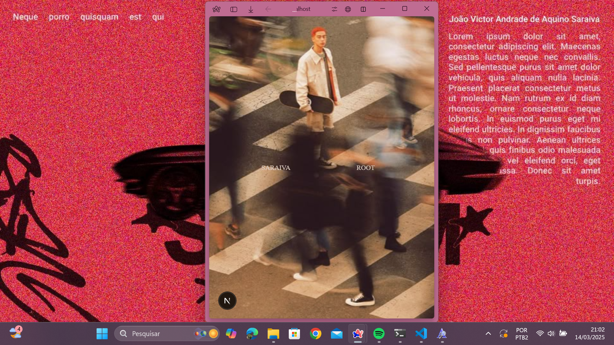
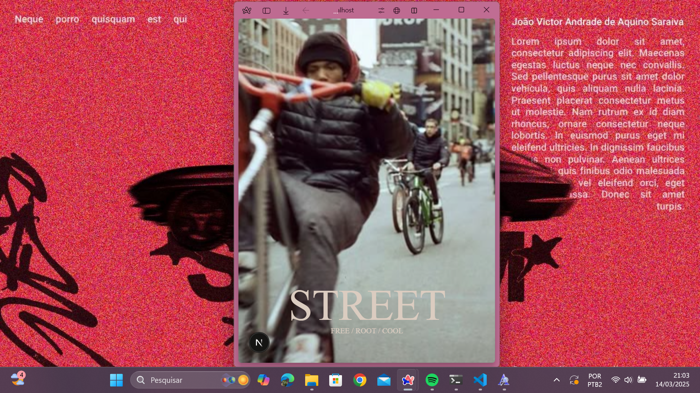
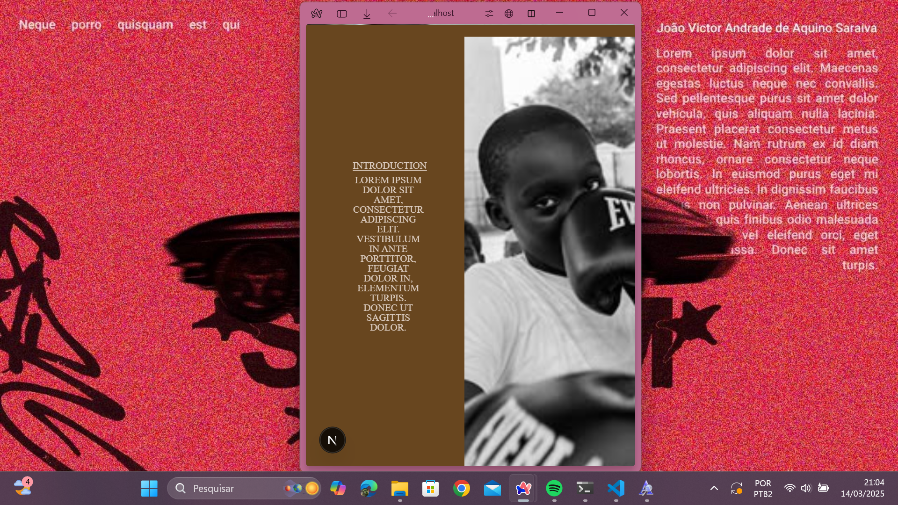
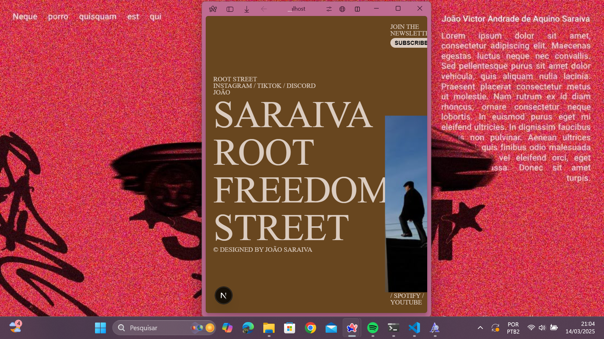

# Root Street

🚀 **Root Street** é um projeto estiloso e dinâmico, trazendo um site com efeitos parallax e uma experiência visual fluida para destacar o estilo de vida street.

## 🌟 Tecnologias Utilizadas

- [Next.js](https://nextjs.org/) - Framework React para desenvolvimento web
- [React](https://react.dev/) - Biblioteca para construção da UI
- [React Lenis](https://github.com/studio-freight/react-lenis) - Suavização de rolagem
- CSS Customizado - Estilização moderna para um layout impactante

## 📸 Capturas de Tela

🚧 *Em breve* 🚧

## 🎯 Funcionalidades

✔️ Efeito Parallax em imagens com **React Lenis** e **ParallaxImage**
✔️ Seções organizadas: Hero, Projects, About, Banner e Footer
✔️ Design responsivo e moderno
✔️ Navegação fluída
✔️ Animações suaves

## 📦 Instalação

Para rodar o projeto localmente, siga os passos abaixo:

```sh
# Clone o repositório
git clone https://github.com/seu-usuario/root-street.git

# Acesse a pasta do projeto
cd root-street

# Instale as dependências
npm install

# Inicie o servidor de desenvolvimento
npm run dev
```

O projeto estará disponível em `http://localhost:3000/`.

## 🚀 Deploy

O projeto pode ser facilmente publicado em plataformas como [Vercel](https://vercel.com/) ou [Netlify](https://www.netlify.com/).

## 🛠 Estrutura do Projeto

```
root-street/
│-- public/
│   ├── portraits/ (Imagens do projeto)
│-- src/
│   ├── components/
│   │   ├── ParallaxImage.js
│   ├── pages/
│   │   ├── index.js (Página principal)
│-- styles/
│-- package.json
│-- README.md
```

## 📌 Contribuição

1. Faça um **fork** do projeto
2. Crie uma **branch** para sua feature (`git checkout -b minha-feature`)
3. Commit suas mudanças (`git commit -m 'Adiciona nova feature'`)
4. Faça um **push** para a branch (`git push origin minha-feature`)
5. Abra um **Pull Request**

## 📄 Licença

📜 Este projeto está sob a licença MIT - sinta-se livre para utilizá-lo e modificá-lo!

---

## Telas







💻 Feito com ❤️ por **João Saraiva**

